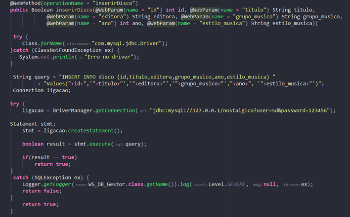

# Sistemas-Distribuídos---Web-Services


## INSTITUTO POLITÉCNICO DE BRAGANÇA - CAMPUS MIRANDELA

#### Desenvolvido por: PATRICK SILVA MENEZES


# INTRODUÇÃO

```
O trabalho da disciplina de Sistemas Distribuídos sobre Web Services,
consiste no desenvolvimento de um sistema de aluguel de discos, usando a
tecnologia web service que permite a comunicação entre aplicações através
do uso de protocolos de comunicação TCP/IP, fazendo uso de várias funções
de software que garantem a comunicação entre as aplicações,
para este trabalho foi utilizado a API jdbc do JAVA que permitiu a execução de querys SQL, triggers
e transações atômicas a base de dados do sistema de aluguel de discos.
```
# OBJETIVO

```
Considere o sistema descrito e desenvolva uma plataforma de Web Services,
baseados em SOAP, capaz de permitir a interação com o sistema
apresentado. Implemente, igualmente, um cliente capaz de consumir as
operações da sua plataforma de web services.
```
# METODOLOGIA – SERVIDOR

# 1. CLASSES CRIADAS

```
Para cada classe criada foram definidos os atributos e métodos Setters e
Getters respectivos a cada atributo.
```
## 1.1. CLASSE ALUGUER


## 1.2. CLASSE ASSOCIADO


## 1.3. CLASSE DISCO


## 1.4. CLASSE HISTÓRICO


## 1.5. CLASSE WS_DB_GESTOR (CLASSE QUE IMPLEMENTA

### OS WEB METHODS)

```
Classe na qual implementei os métodos solicitados, que serão
explicados em seguida.
```
# 2. WEB METHODS IMPLEMENTADOS NA CLASSE

## WS_DB_GESTOR

## 2.1. METODO INSERIR ASSOCIADO


```
Esse método permite inserir um associado na tabela associado da base de
dados nostalgico, passando os WebParam correspondentes ao mesmo tipo de
dados definidos na tabela associado, fazendo a conexão com o banco de
dados através da API java jdbc passando usuário e palavra-passe, logo em
seguida é criado um Statement (interface utilizada para executar querys SQL ou MySQL), o qual executa a query definida de inserção através da função execute(), que retorna um valor booleano, se o valor em result for true quer dizer que a inserção correu bem, se não correu bem, retorna false, no catch do método será retornado false.
```

## 2.2. METODO REMOVER ASSOCIADO


```
Esse método permite remover um associado na tabela associado da base de
dados nostalgico, passando o WebParam id do respectivo associado que se
deseja remover, fazendo a conexão com o banco de dados através da API
java jdbc passando usuário e palavra-passe, logo em seguida é criado um
Statement (interface utilizada para executar querys SQL ou MySQL), o qual
executa a query definida de remoção através da função executeUpdate(), que nesse caso não retorna nenhum valor boleano, mas sim a quantidade de
registros que são afetados pela execução da query definida, a lógica é
parecida com a de inserir porém agora o que se leva em consideração é a
quantidade de linhas afetadas, que nesse caso de remoção apenas 1 linha
deve ser afetada, caso seja 1 o retorno em rowsaffected, é retornado true, caso não tenha afetado nenhuma linha é retornado false no catch do método.
```

## 2.3. METODO INSERIR DISCO



```
Esse método permite inserir um disco na tabela disco da base de dados
nostalgico, passando os WebParam correspondentes ao mesmo tipo de dados
definidos na tabela associado, fazendo a conexão com o banco de dados
através da API java jdbc passando usuário e palavra-passe, logo em seguida é criado um Statement (interface utilizada para executar querys SQL ou MySQL), o qual executa a query definida de inserção através da função execute(), que retorna um valor booleano, se o valor em result for true quer dizer que a inserção correu bem, se não correu bem, retorna false, no catch do método será retornado false.
```

## 2.4. MÉTODO REMOVER DISCO


```
Esse método permite remover um disco na tabela disco da base de dados
nostalgico, passando o WebParam id do respectivo associado que se deseja
remover, fazendo a conexão com o banco de dados através da API java jdbc
passando usuário e palavra-passe, logo em seguida é criado um Statement
(interface utilizada para executar querys SQL ou MySQL), o qual executa a
query definida de remoção através da função executeUpdate(), que nesse
caso não retorna nenhum valor boleano, mas sim a quantidade de registros
que são afetados pela execução da query definida, a lógica é parecida com a
de inserir porém agora o que se leva em consideração é a quantidade de
linhas afetadas, que nesse caso de remoção apenas 1 linha deve ser afetada,
caso seja 1 o retorno em rowsaffected, é retornado true, caso não tenha
afetado nenhuma linha é retornado false no catch do método.
```

## 2.5. MÉTODO PESQUISA DISCO POR TÍTULO


```
Esse método permite pesquisar discos na tabela disco da base de dados
nostalgico, passando o WebParam titulo do respectivo disco que se deseja
pesquisar, fazendo a conexão com o banco de dados através da API java
jdbc passando usuário e palavra-passe, esse método é do tipo
ArrayList<Disco>, ou seja retorna um ArrayList que armazena objetos
Disco. Sendo assim, primeiro cria-se o statement e em seguida é usado esse statement para fazer o executeQuery() que retorna um ResultSet o qual é armazenado na variável result, antes de percorrer result, é feito a eliminação de qualquer registro que possa ter ficado no ArrayList<Disco> discos após a execução da última instrução, o que foi notável na fase de testes, que após uma execução ficavam registros repetidos. Logo em seguida, é percorrido o ResultSet retornado em result ate o ultimo registro através da função next() dentro de um loop While, e os dados do disco eram obtidos por meio das funções get do respectivo tipo da coluna que se desejava acessar e setados no objeto disc criado antes do loop através dos Setters criados na classe Disco, por fim no ArrayList<Disco> discos é adicionado o objeto disc e por fim retornado o ArrayList<Disco> discos.
```
## 2.6. MÉTODO PESQUISA DISCO POR GRUPO MUSICO


```
Esse método permite pesquisar discos na tabela disco da base de dados
nostalgico, passando o WebParam grupo_musico dos respectivos discos
que se deseja pesquisar, fazendo a conexão com o banco de dados através
da API java jdbc passando usuário e palavra-passe, esse método é do tipo
ArrayList<Disco>, ou seja retorna um ArrayList que armazena objetos
Disco. Sendo assim, primeiro cria-se o statement e em seguida é usado esse statement para fazer o executeQuery() que retorna um ResultSet o qual é armazenado na variável result, antes de percorrer result, é feito a eliminação de qualquer registro que possa ter ficado no ArrayList<Disco> discos após a execução da última instrução, o que foi notável na fase de testes, que após uma execução ficavam registros repetidos. Logo em seguida, é percorrido o ResultSet retornado em result ate o ultimo registro através da função next() dentro de um loop While, e os dados do disco eram obtidos por meio das funções get do respectivo tipo da coluna que se desejava acessar e setados no objeto disc criado antes do loop através dos Setters criados na classe Disco, por fim no ArrayList<Disco> discos é adicionado o objeto disc e por fim retornado o ArrayList<Disco> discos.
```
## 2.7. MÉTODO PESQUISA DISCO POR ESTILO MUSICA


```
Esse método permite pesquisar discos na tabela disco da base de dados
nostalgico, passando o WebParam estilo_musica dos respectivos discos que
se deseja pesquisar, fazendo a conexão com o banco de dados através da
API java jdbc passando usuário e palavra-passe, esse método é do tipo
ArrayList<Disco>, ou seja retorna um ArrayList que armazena objetos
Disco. Sendo assim, primeiro cria-se o statement e em seguida é usado esse statement para fazer o executeQuery() que retorna um ResultSet o qual é armazenado na variável result, antes de percorrer result, é feito a eliminação de qualquer registro que possa ter ficado no ArrayList<Disco> discos após a execução da última instrução, o que foi notável na fase de testes, que após uma execução ficavam registros repetidos. Logo em seguida, é percorrido o ResultSet retornado em result ate o ultimo registro através da função next() dentro de um loop While, e os dados do disco eram obtidos por meio das funções get do respectivo tipo da coluna que se desejava acessar e setados no objeto disc criado antes do loop através dos Setters criados na classe Disco, por fim no ArrayList<Disco> discos é adicionado o objeto disc e por fim retornado o ArrayList<Disco> discos.
```
## 2.8. MÉTODO ALUGA DISCO


```
Esse método permite alugar discos na tabela disco da base de dados
nostalgico, passando os WebParameters id_associado, id_disco,
data_aluguer, data_max_devolucao, fazendo a conexão com o banco de
dados através da API java jdbc passando usuário e palavra-passe.
Primeiramente, o auto commit é desabilitado porque somente quando as duas
transações atomicas acontecerem que deve ser feito o commit da instrução,
que são a de inserção na tabela aluguer e de criação do trigger alugaDisco que deleta o disco alugado da tabela disco, depois do mesmo ter sido inserido na tabela aluguer. Segundamente, para esse método, usei o PreparedStatement no qual os Values da instrução insert são passados por meio de Setters de acordo com cada tipo de dado das colunas da tabela aluguer, os 2 parâmetros data_aluguer e data_max_devolucao precisaram ser convertidos para o tipo Date pois são recebidos no tipo String. Para isso (como exemplo usarei o parametro data_max_devolucao), foi declarada uma variável dateDevolucao do tipo java.util.Date e inicializada com valor null, logo em seguida é feito o parsing da string data_max_devolucao em um objeto do tipo Date, usando o formato de data definido pelo objeto sdf do tipo SimpleDateFormat, caso corra bem, é transformado a string em um objeto do tipo Date, caso corra mal é feito o disparo de um ParseException, após isso é criado um objeto sqlDateDevolucao do tipo java.sql.Date usando como parametro o tempo em milisegundos do objeto dateDevolucao e então é setado o objeto sqlDateDevolucao correspondendo ao tipo da coluna definida na tabela aluguer e por fim é feito o commit.
```

## 2.9. MÉTODO DEVOLVE DISCO
  
  
  

```
Esse método permite devolver discos alugados da tabela aluguer da base de
dados nostalgico, passando os WebParameters id_associado, id_disco,
data_aluguer, data_devolucao, data_max_devolucao, fazendo a conexão
com o banco de dados através da API java jdbc passando usuário e palavra-
passe. Primeiramente, o auto commit é desabilitado porque somente quando
as duas transações atomicas acontecerem que deve ser feito o commit da
instrução, que são a de inserção na tabela historico e de criação do trigger devolveDisco que deleta o disco alugado da tabela alguer, depois do mesmo ter sido inserido na tabela historico. Segundamente, para esse método, usei o PreparedStatement no qual os Values da instrução insert são passados por meio de Setters de acordo com cada tipo de dado das colunas da tabela aluguer, os 2 parâmetros data_aluguer e data_devolucao precisaram ser convertidos para o tipo Date pois são recebidos no tipo String. Para isso (como exemplo usarei o parametro data_devolucao), foi declarada uma variável dateDevolucao do tipo java.util.Date e inicializada com valor null, logo em seguida é feito o parsing da string data_devolucao em um objeto do tipo Date, usando o formato de data definido pelo objeto sdf do tipo SimpleDateFormat, caso corra bem, é transformado a string em um objeto do tipo Date, caso corra mal é feito o disparo de um ParseException, após isso é criado um objeto sqlDateDevolucao do tipo java.sql.Date usando como
parametro o tempo em milisegundos do objeto dateDevolucao e então é
setado o objeto sqlDateDevolucao correspondendo ao tipo da coluna
definida na tabela historico, e antes de ser feito o commit é feito o cálculo
do valor da multa pela diferença entre data_devolucao e
data_max_devolucao dessa forma é possível obter a multa que deverá ser
aplicada ao associado caso haja atraso na devolucao do disco e como a taxa
é de 1€ basta fazer a diferença de dias entre as datas caso seja maior que 0 é
mostrado o valor calculado da multa caso não apenas uma mensagem para
informar ao associado que o disco foi devolvido com sucesso mas com uma
multa aplicada e o valor calculado da mesma, e então é feito o commit.
```

# 3. METODOLOGIA – CLIENTE

## 3.1. MÉTODOS E MENU DE SELEÇÃO


```
O cliente foi criado com a intenção de consumir os métodos criados no
servidor de forma interativa através de um menu de seleção, onde para
cada opção são solicitados os dados do respectivo método invocado,
sendo assim foi preciso apenas passar para a classe Cliente_trabalhoWS
os métodos do Servidor através do diretório Web Service References.
```
## 3.2. MENU DE SELEÇÃO – CLIENTE OUTPUT NETBEANS


## 3.3 FORMULÁRIO WEB TESTER – BROWSER


# 4. CONCLUSÃO

```
Através do desenvolvimento desse trabalho, foi possível entender melhor
os conceitos relacionados a web services, fazendo uso de tecnologias que
possibilitassem a comunicação entre o servidor e a base de dados e
entendendo a finalidade de cada tecnologia aprendida ao longo do
processo de desenvolvimento desse trabalho, desde a fase de
desenvolvimento a fase de testes, onde pude testar várias lógicas que
direcionavam para o mesmo resultado e ainda pude perceber um conceito
diferente do usado em sala de aula que foi o PreparedStatement, que evita
o SQL injection, ou seja, evita que hackers executem comandos SQL na
database. Por fim, considero que o trabalho contribuiu de forma positiva
no meu aprendizado e aumentou mais ainda meu interesse pela área de
back-end, onde pude ainda por em prática meus conhecimentos
aprendidos na disciplina de Base de Dados II.
```

